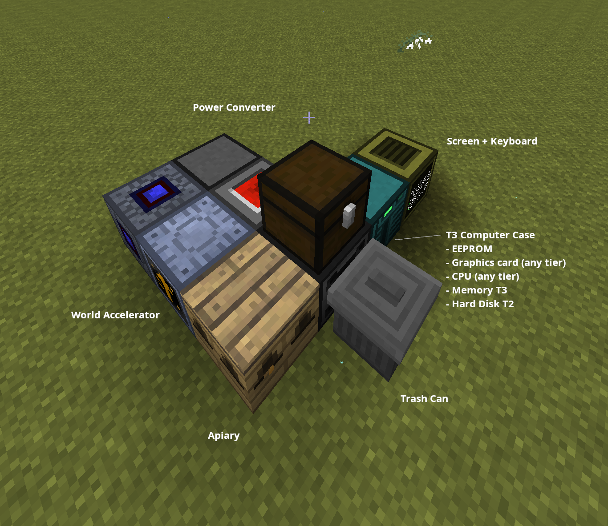

# Bee Stats Applicator
## Setup
- Apiary
- Oblivion Frame (optional, but highly recommended)
- World Accelerator (optional)
- Machine Controller Cover (optional, required for WA)
- Trash Can
- Chest (any)
- OpenComputer things:
  - Power Converter
  - Redstone IO (optional, required for WA)
  - Transposer
  - Tier 2+ Case
  - EEPROM
  - Graphics card (any tier)
  - CPU (any tier)
  - Memory T2+
  - Hard Disk T2+
  - Screen (any)
  - Keyboard



- Make sure to have the Apiary, Chest, and Trash Can touching the Transposer.
- (optional) WA touching Apiary & Redstone IO. Put the Machine Controller Cover on the WA on the Redstone IO face. Set to `Enable with Redstone`.

## Running
1. Put princess w/ target species in slot 1 of the chest
2. Put drones with the stats in slot 2 of the chest
3. If using a frame - make sure the frame is fully repaired, just in case.
4. Open the screen and run `./breed_stats.lua`

You should see output like this over the course of the breeding:
```
[INFO] apiary=front, chest=top, trash=left
[INFO] desired_stats={"?1":"forestry.boolTrue","effect":"forestry.effectNone","territory":"forestry.territoryAverage","species":"magicbees.speciesSilicon","tolerantFlyer":"forestry.boolTrue","speed":"magicbees.speedBlinding","humidity":"forestry.toleranceBoth5","fertility":"forestry.fertilityMaximum","temperature":"forestry.toleranceBoth5","lifespan":"forestry.lifespanShorter","flowers":"extrabees.flower.rock","?4":"forestry.boolTrue","pollination":"forestry.floweringFast"}
[INFO] Continuing with best drone {best=126, princess=126, max=242}
[INFO] Swapping in stat drone {best=227, princess=238, max=242}
[INFO] Continuing with best drone {best=141, princess=139, max=242}
[INFO] Continuing with best drone {best=241, princess=142, max=242}
[INFO] Continuing with best drone {best=242, princess=141, max=242}
[INFO] Continuing with best drone {best=242, princess=141, max=242}
[INFO] Breeding complete after 6 generations
```

## Notes & Limitations
- If the princess and drones no longer contain the target species, the program will exit. This is more likely to happen when Fertility is low
- If the frame gets to low durability, the program will exit.
- The program doesn't save its progress, so if the instance crashes or is shut down, it may or may not be recoverable upon running again.
